# 🍋Lemon(Letter Monster)

### **삼성 청년 SW아카데미(SSAFY) 10th 자율 프로젝트**

&nbsp;
&nbsp;

## **📅 프로젝트 진행 기간**
### **2024.04.09 ~ 2024.05.20(6주)**

&nbsp;

## **🧐 프로젝트 소개**

**💛서비스 한줄 소개💛**

> **내가 그린 그림이 움직인다면??**  
> ‘**Lemon**’은 내가 그린 캐릭터로 편지를 주고 받는 **소통 서비스**입니다!
>

&nbsp;

## **💑 멤버 소개**
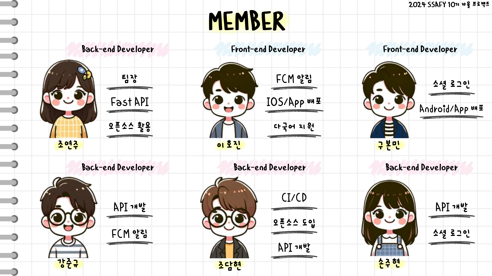

&nbsp;

## **⚙️ 기술 스택**

| | |
| --- | --- |
| Back-end |         |
| Front-end |           |
| AI |    |
| Infra |         |
| Tools |     |

&nbsp;

## 🛠️ 시스템 아키텍처
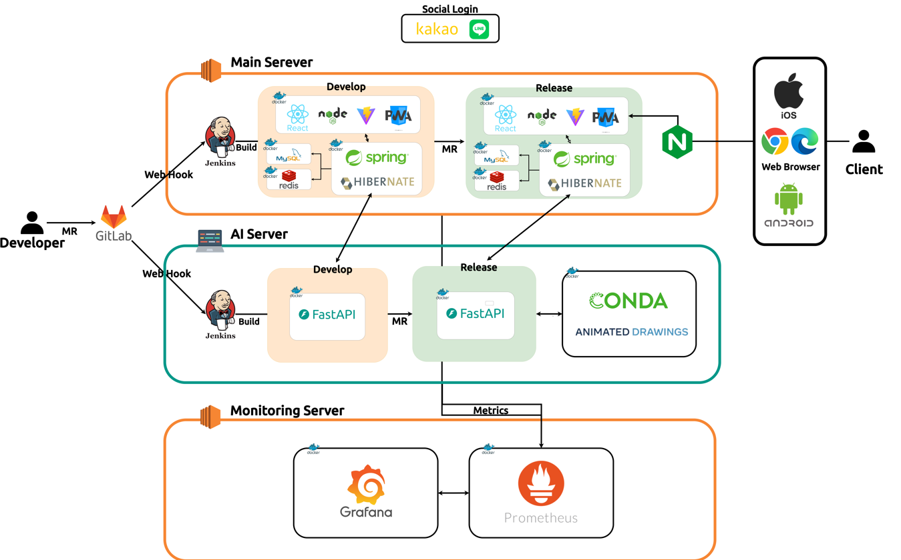

&nbsp;

## 📈 ERD
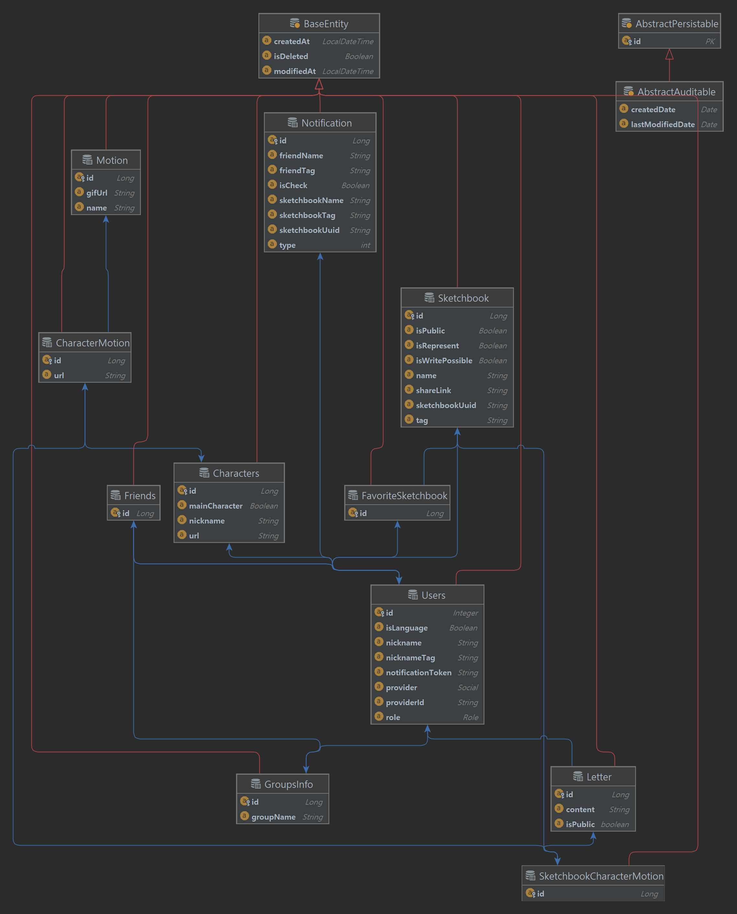{: width="70%" height="70%"}
&nbsp;

## **🧾 기능 소개**
### 카카오, 라인 로그인

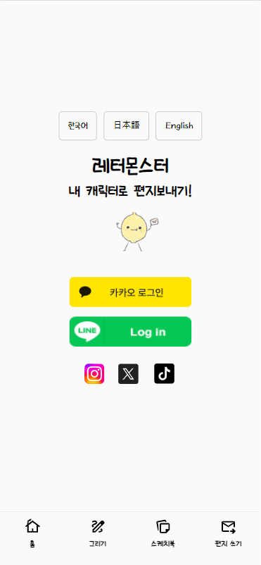

&nbsp;

### 캐릭터 그리기

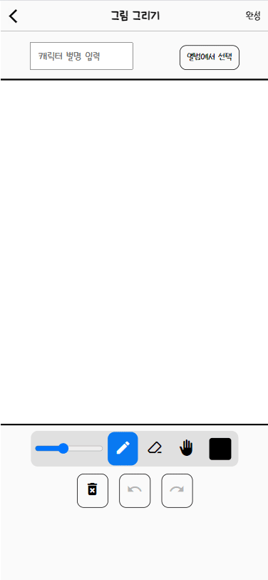

&nbsp;

### 편지 작성

&nbsp;

### 편지 확인

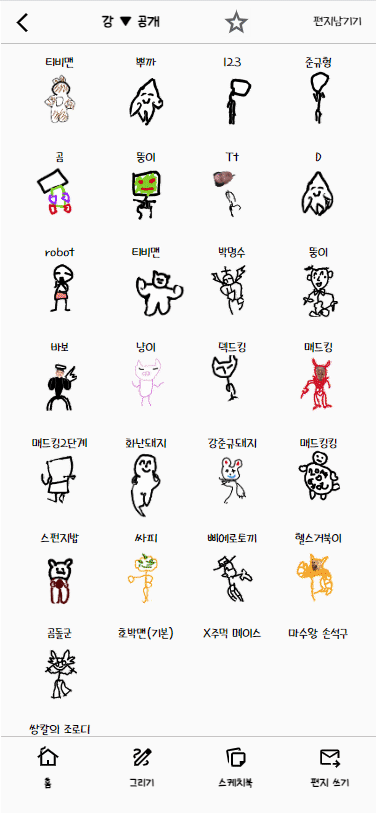

&nbsp;

### 비회원 편지 작성

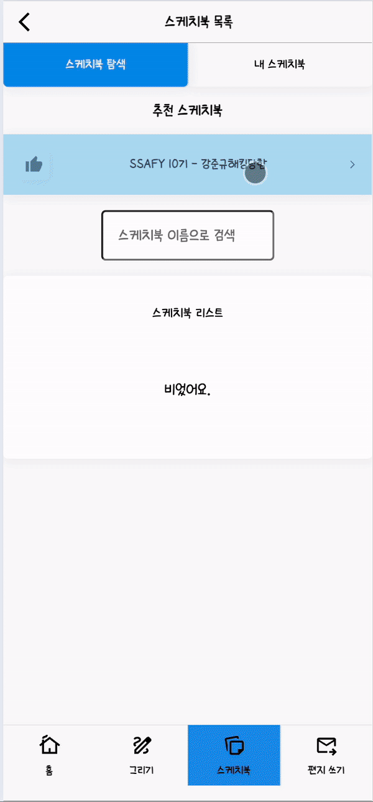

&nbsp;

### 답장하기

&nbsp;

### 스케치북 삭제

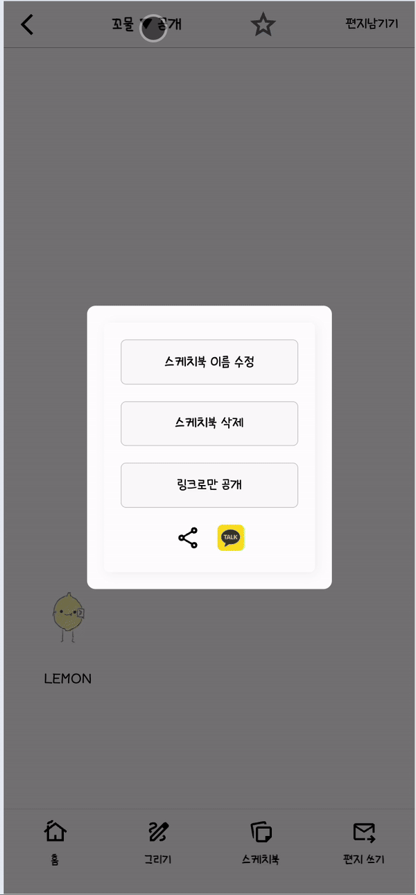

&nbsp;

### 스케치북 이름 수정

&nbsp;

### 스케치북 검색

&nbsp;

### 스케치북 공개 여부 설정

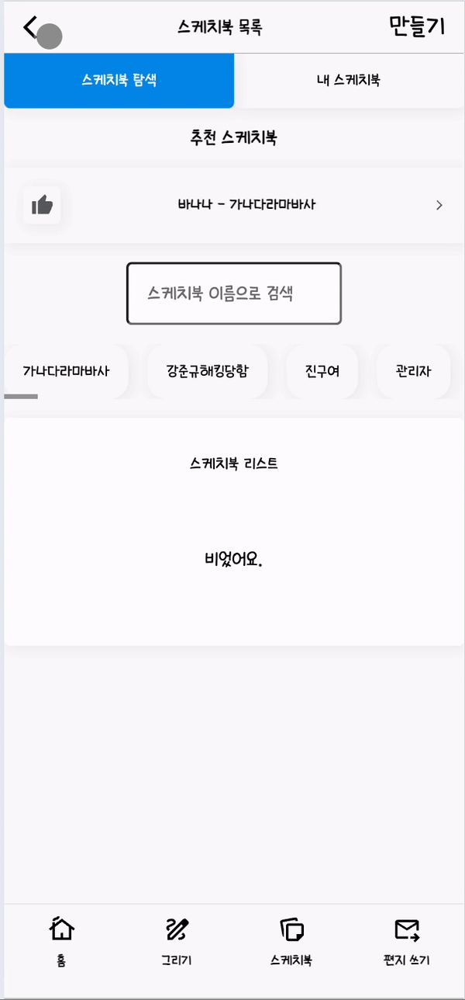

&nbsp;

### 친구 추가

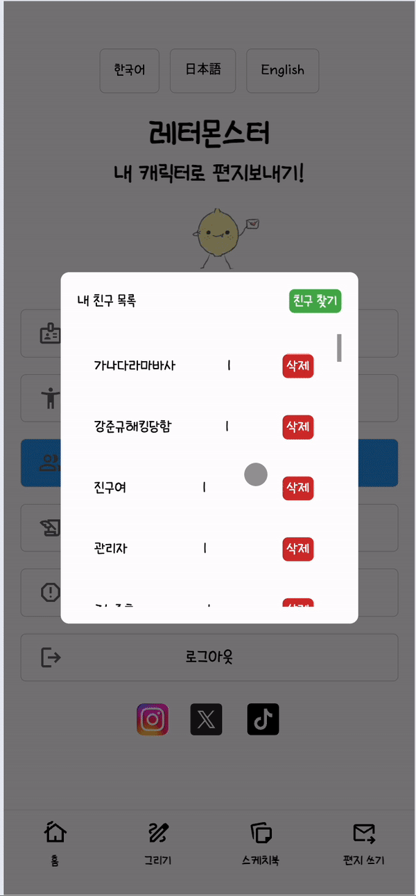

&nbsp;

### 즐겨찾기 등록

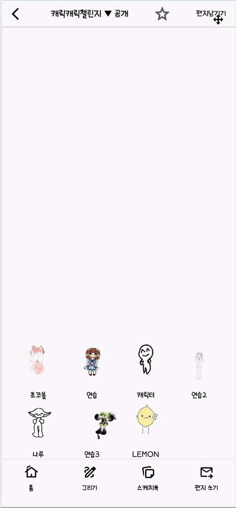

&nbsp;

## ✅ 활용 기술 및 설명
### Infra

#### **1. 개발환경과 운영환경 분리**

- jenkins에 빌드한 코드를 develop브랜치의 환경에서 테스트 후, 모든 기능이 완벽하게 동작하면
release브랜치에 merge하는 방식으로 아키텍쳐 설계
- 자유로운 개발과 테스트 및 안정된 서비스를 가능하게 함.

#### **2. 무중단 배포 적용**

- 운영서버에 자동배포 시 서버가 빌드타임 약 20초간 다운되는 문제가 있어, blue-green 전략을 채택하여 무중단 배포 구현.
- 두 개의 동일한 환경인 블루와 그린을 적용하여, 새로운 버전의 소프트웨어를 배포하고 롤백할 수 있게 함.
- blue가 실행중이면 green을 대기 중으로, 새로운 배포 시 green이 빌드되는 동안 blue를 적용
- 배포 테스트가 정상적으로 성공하면 blue 컨테이너를 종료시키고 green 컨테이너로 전환
- 테스트 중 문제 발생 시에는 blue 환경으로 롤백.

##### **blue-green 전략의 장점**

- 무중단 배포 : 사용자는 배포 중 서비스 중단을 경험하지 않음.
- 즉각적인 롤백 : 문제가 발생할 경우 빠르게 이전 버전으로 롤백가능.
- 테스트 용이성 : 환경 전환 전 새로운 버전을 철저하게 테스트 가능.

#### **3. 홈서버 구축**

- 정적인 그림을 동적인 gif로 생성해주는 Meta사의 Animated Drawings 사용. 해당 라이브러리는 이미지의 관절 포인트를 생성하고 이를 통해 모션을 만들어 gif파일로 추출하는데, 이 연산에 있어 **하드웨어의 성능이 중요하게 작용함**.
- 그렇기에 안정적인 CPU를 사용하는 기존의 EC2 서버에 비해, **조금 더 최신의 성능을 사용하는 CPU가 필요**했음.
- 보유한 개인 노트북의 CPU 성능이 i7-11600에 12CPU로 월등한 CPU 성능을 보유
- 결국 gif 생성에 필요한 Fast API 서버와 Animated Drawings 모델을 위한 홈 서버 구축을 계획하여, **개인 노트북에 우분투 환경을 새로 설치하여 홈 서버로 구축**
- 공유기로 홈 서버에 고정ip를 할당한 다음, 공인 ip를 통해 포트포워딩 하여 외부에서 홈 서버에 접근할 수 있도록 함.
- 그 결과, **50초정도 소요되는 렌더링 시간이 5초 정도의 시간으로 성능을 향상** 및 사용자 경험을 개선시킴.

&nbsp;

### FE

#### **Capacitor - onestore**

- Capacitor를 통해 웹 기반의 프로젝트를 모바일 네이티브 코드로 변환시켜 각 환경에 최적화된 애플리케이션 지원을 실현시킴.
- OneStore에 Android App Release

#### **CSR 채택**

- 이미지 로딩이 많고 화면 전환이 잦은 프로젝트 특성상 캐시를 통한 최적화된 로딩과 빠른 인터랙션을 위해 클라이언트 사이드 렌더링을 채택함.

#### **ga4**

- 구글 애널리틱스4를 적용해 방문자의 체류시간, 이용 실태를 파악 후 개선하려 노력함.

#### **PWA**

- 풀반응형 화면을 지원하면서 PWA 사용자가 모든 기기(핸드폰, 태블릿, 노트북)에서 앱 설치의 부담 없이 네이티브 환경에서 서비스를 이용할 수 있도록 함.

&nbsp;

### BE

#### **SpringSecurity**

#### **FCM**

- 파이어베이스 토큰을 이용해 사용자의 기기에 알림이 갈 수 있도록 함
- 기존 파이어베이스 토큰을 지원하지 않는 기기에 로그인 할 경우 null로 반환되어 제대로 된 token을 받을 수 없던 문제는 조건문을 통해 해결
- Google의 Firebase에서 제공하는 클라우드 메세징
- 알림기능 구현을 안정적, 무료로 이용하기 위해 사용

#### **JPA**

- 개발 생산성, 유지 보수성 향상을 위해 JPA를 사용.
- EntityManager를 통해 객체를 관리함으로써 명시적인 **SQL작성 없이도 데이터베이스 작업 수행** 가능
- DB종류를 변경하는것이 기존 SQL mapper에 비해 쉬움

## 📂 프로젝트 디렉토리 구조

  

  Back-End
  

    📦src
      ┣ 📂main
      ┃ ┣ 📂generated
      ┃ ┃ ┗ 📂com
      ┃ ┃ ┃ ┗ 📂lemon
      ┃ ┃ ┃ ┃ ┗ 📂backend
      ┃ ┃ ┃ ┃ ┃ ┗ 📂domain
      ┃ ┃ ┃ ┃ ┃ ┃ ┣ 📂base
      ┃ ┃ ┃ ┃ ┃ ┃ ┃ ┗ 📜QBaseEntity.java
      ┃ ┃ ┃ ┃ ┃ ┃ ┣ 📂characters
      ┃ ┃ ┃ ┃ ┃ ┃ ┃ ┗ 📂entity
      ┃ ┃ ┃ ┃ ┃ ┃ ┃ ┃ ┣ 📜QCharacterMotion.java
      ┃ ┃ ┃ ┃ ┃ ┃ ┃ ┃ ┣ 📜QCharacters.java
      ┃ ┃ ┃ ┃ ┃ ┃ ┃ ┃ ┗ 📜QMotion.java
      ┃ ┃ ┃ ┃ ┃ ┃ ┣ 📂FavoriteSketchbook
      ┃ ┃ ┃ ┃ ┃ ┃ ┃ ┗ 📂entity
      ┃ ┃ ┃ ┃ ┃ ┃ ┣ 📂friend
      ┃ ┃ ┃ ┃ ┃ ┃ ┃ ┗ 📂entity
      ┃ ┃ ┃ ┃ ┃ ┃ ┣ 📂letter
      ┃ ┃ ┃ ┃ ┃ ┃ ┃ ┗ 📂entity
      ┃ ┃ ┃ ┃ ┃ ┃ ┃ ┃ ┗ 📜QLetter.java
      ┃ ┃ ┃ ┃ ┃ ┃ ┣ 📂notification
      ┃ ┃ ┃ ┃ ┃ ┃ ┃ ┗ 📂entity
      ┃ ┃ ┃ ┃ ┃ ┃ ┣ 📂sketchbook
      ┃ ┃ ┃ ┃ ┃ ┃ ┃ ┗ 📂entity
      ┃ ┃ ┃ ┃ ┃ ┃ ┃ ┃ ┗ 📜QSketchbook.java
      ┃ ┃ ┃ ┃ ┃ ┃ ┗ 📂users
      ┃ ┃ ┃ ┃ ┃ ┃ ┃ ┗ 📂user
      ┃ ┃ ┃ ┃ ┃ ┃ ┃ ┃ ┗ 📂entity
      ┃ ┃ ┃ ┃ ┃ ┃ ┃ ┃ ┃ ┗ 📜QUsers.java
      ┃ ┣ 📂java
      ┃ ┃ ┗ 📂com
      ┃ ┃ ┃ ┗ 📂lemon
      ┃ ┃ ┃ ┃ ┗ 📂backend
      ┃ ┃ ┃ ┃ ┃ ┣ 📂domain
      ┃ ┃ ┃ ┃ ┃ ┃ ┣ 📂base
      ┃ ┃ ┃ ┃ ┃ ┃ ┃ ┗ 📜BaseEntity.java
      ┃ ┃ ┃ ┃ ┃ ┃ ┣ 📂characters
      ┃ ┃ ┃ ┃ ┃ ┃ ┃ ┣ 📂controller
      ┃ ┃ ┃ ┃ ┃ ┃ ┃ ┃ ┗ 📜CharacterController.java
      ┃ ┃ ┃ ┃ ┃ ┃ ┃ ┣ 📂dto
      ┃ ┃ ┃ ┃ ┃ ┃ ┃ ┃ ┣ 📂response
      ┃ ┃ ┃ ┃ ┃ ┃ ┃ ┃ ┃ ┣ 📜CharacterInfoDto.java
      ┃ ┃ ┃ ┃ ┃ ┃ ┃ ┃ ┃ ┣ 📜CharacterMotionProjection.java
      ┃ ┃ ┃ ┃ ┃ ┃ ┃ ┃ ┃ ┣ 📜CharacterMotionSketchbookProjection.java
      ┃ ┃ ┃ ┃ ┃ ┃ ┃ ┃ ┃ ┣ 📜CharactersGetDto.java
      ┃ ┃ ┃ ┃ ┃ ┃ ┃ ┃ ┃ ┣ 📜CharactersIdDto.java
      ┃ ┃ ┃ ┃ ┃ ┃ ┃ ┃ ┃ ┣ 📜ImageUrlDto.java
      ┃ ┃ ┃ ┃ ┃ ┃ ┃ ┃ ┃ ┣ 📜RepresentMotionDto.java
      ┃ ┃ ┃ ┃ ┃ ┃ ┃ ┃ ┃ ┗ 📜SelectCharacterMotionDto.java
      ┃ ┃ ┃ ┃ ┃ ┃ ┃ ┃ ┣ 📜CharacterMotionToSketchbookDto.java
      ┃ ┃ ┃ ┃ ┃ ┃ ┃ ┃ ┗ 📜CharacterToSketchbookDto.java
      ┃ ┃ ┃ ┃ ┃ ┃ ┃ ┣ 📂entity
      ┃ ┃ ┃ ┃ ┃ ┃ ┃ ┃ ┣ 📜CharacterMotion.java
      ┃ ┃ ┃ ┃ ┃ ┃ ┃ ┃ ┣ 📜Characters.java
      ┃ ┃ ┃ ┃ ┃ ┃ ┃ ┃ ┗ 📜Motion.java
      ┃ ┃ ┃ ┃ ┃ ┃ ┃ ┣ 📂repository
      ┃ ┃ ┃ ┃ ┃ ┃ ┃ ┃ ┣ 📜CharacterMotionRepository.java
      ┃ ┃ ┃ ┃ ┃ ┃ ┃ ┃ ┣ 📜CharacterRepository.java
      ┃ ┃ ┃ ┃ ┃ ┃ ┃ ┃ ┗ 📜MotionRepository.java
      ┃ ┃ ┃ ┃ ┃ ┃ ┃ ┗ 📂service
      ┃ ┃ ┃ ┃ ┃ ┃ ┃ ┃ ┣ 📂impl
      ┃ ┃ ┃ ┃ ┃ ┃ ┃ ┃ ┃ ┗ 📜CharacterServiceImpl.java
      ┃ ┃ ┃ ┃ ┃ ┃ ┃ ┃ ┣ 📜CharacterMotionService.java
      ┃ ┃ ┃ ┃ ┃ ┃ ┃ ┃ ┣ 📜CharacterService.java
      ┃ ┃ ┃ ┃ ┃ ┃ ┃ ┃ ┗ 📜MotionService.java
      ┃ ┃ ┃ ┃ ┃ ┃ ┣ 📂FavoriteSketchbook
      ┃ ┃ ┃ ┃ ┃ ┃ ┃ ┣ 📂controller
      ┃ ┃ ┃ ┃ ┃ ┃ ┃ ┃ ┗ 📜FavoriteSketchbookController.java
      ┃ ┃ ┃ ┃ ┃ ┃ ┃ ┣ 📂dto
      ┃ ┃ ┃ ┃ ┃ ┃ ┃ ┃ ┣ 📜FavoriteRequestDto.java
      ┃ ┃ ┃ ┃ ┃ ┃ ┃ ┃ ┣ 📜FavoriteSketchbookCreateDto.java
      ┃ ┃ ┃ ┃ ┃ ┃ ┃ ┃ ┣ 📜FavoriteSketchbookGetDto.java
      ┃ ┃ ┃ ┃ ┃ ┃ ┃ ┃ ┗ 📜FavoriteSketchbookGetOneDto.java
      ┃ ┃ ┃ ┃ ┃ ┃ ┃ ┣ 📂entity
      ┃ ┃ ┃ ┃ ┃ ┃ ┃ ┃ ┗ 📜FavoriteSketchbook.java
      ┃ ┃ ┃ ┃ ┃ ┃ ┃ ┣ 📂repository
      ┃ ┃ ┃ ┃ ┃ ┃ ┃ ┃ ┣ 📂custom
      ┃ ┃ ┃ ┃ ┃ ┃ ┃ ┃ ┃ ┣ 📜FavoriteSketchbookRepositoryCustom.java
      ┃ ┃ ┃ ┃ ┃ ┃ ┃ ┃ ┃ ┗ 📜FavoriteSketchbookRepositoryImpl.java
      ┃ ┃ ┃ ┃ ┃ ┃ ┃ ┃ ┗ 📜FavoriteSketchbookRepository.java
      ┃ ┃ ┃ ┃ ┃ ┃ ┃ ┗ 📂service
      ┃ ┃ ┃ ┃ ┃ ┃ ┃ ┃ ┣ 📂impl
      ┃ ┃ ┃ ┃ ┃ ┃ ┃ ┃ ┃ ┗ 📜FavoriteSketchbookServiceImpl.java
      ┃ ┃ ┃ ┃ ┃ ┃ ┃ ┃ ┗ 📜FavoriteSketchbookService.java
      ┃ ┃ ┃ ┃ ┃ ┃ ┣ 📂friend
      ┃ ┃ ┃ ┃ ┃ ┃ ┃ ┣ 📂controller
      ┃ ┃ ┃ ┃ ┃ ┃ ┃ ┃ ┣ 📜FriendsController.java
      ┃ ┃ ┃ ┃ ┃ ┃ ┃ ┃ ┗ 📜GroupsController.java
      ┃ ┃ ┃ ┃ ┃ ┃ ┃ ┣ 📂dto
      ┃ ┃ ┃ ┃ ┃ ┃ ┃ ┃ ┣ 📂request
      ┃ ┃ ┃ ┃ ┃ ┃ ┃ ┃ ┃ ┗ 📜GroupRequestDto.java
      ┃ ┃ ┃ ┃ ┃ ┃ ┃ ┃ ┗ 📂response
      ┃ ┃ ┃ ┃ ┃ ┃ ┃ ┃ ┃ ┣ 📜FriendResponseDto.java
      ┃ ┃ ┃ ┃ ┃ ┃ ┃ ┃ ┃ ┗ 📜GroupResponseDto.java
      ┃ ┃ ┃ ┃ ┃ ┃ ┃ ┣ 📂entity
      ┃ ┃ ┃ ┃ ┃ ┃ ┃ ┃ ┣ 📜Friends.java
      ┃ ┃ ┃ ┃ ┃ ┃ ┃ ┃ ┗ 📜GroupsInfo.java
      ┃ ┃ ┃ ┃ ┃ ┃ ┃ ┣ 📂repository
      ┃ ┃ ┃ ┃ ┃ ┃ ┃ ┃ ┣ 📂custom
      ┃ ┃ ┃ ┃ ┃ ┃ ┃ ┃ ┃ ┣ 📜FriendsRepositoryCustom.java
      ┃ ┃ ┃ ┃ ┃ ┃ ┃ ┃ ┃ ┣ 📜FriendsRepositoryImpl.java
      ┃ ┃ ┃ ┃ ┃ ┃ ┃ ┃ ┃ ┣ 📜GroupsRepositoryCustom.java
      ┃ ┃ ┃ ┃ ┃ ┃ ┃ ┃ ┃ ┗ 📜GroupsRepositoryImpl.java
      ┃ ┃ ┃ ┃ ┃ ┃ ┃ ┃ ┣ 📜FriendsRepository.java
      ┃ ┃ ┃ ┃ ┃ ┃ ┃ ┃ ┗ 📜GroupsRepository.java
      ┃ ┃ ┃ ┃ ┃ ┃ ┃ ┗ 📂service
      ┃ ┃ ┃ ┃ ┃ ┃ ┃ ┃ ┣ 📂impl
      ┃ ┃ ┃ ┃ ┃ ┃ ┃ ┃ ┃ ┣ 📜FriendsServiceImpl.java
      ┃ ┃ ┃ ┃ ┃ ┃ ┃ ┃ ┃ ┗ 📜GroupsServiceImpl.java
      ┃ ┃ ┃ ┃ ┃ ┃ ┃ ┃ ┣ 📜FriendsService.java
      ┃ ┃ ┃ ┃ ┃ ┃ ┃ ┃ ┗ 📜GroupsService.java
      ┃ ┃ ┃ ┃ ┃ ┃ ┣ 📂letter
      ┃ ┃ ┃ ┃ ┃ ┃ ┃ ┣ 📂controller
      ┃ ┃ ┃ ┃ ┃ ┃ ┃ ┃ ┣ 📜LetterController.java
      ┃ ┃ ┃ ┃ ┃ ┃ ┃ ┃ ┗ 📜LetterPublicController.java
      ┃ ┃ ┃ ┃ ┃ ┃ ┃ ┣ 📂dto
      ┃ ┃ ┃ ┃ ┃ ┃ ┃ ┃ ┣ 📂requestDto
      ┃ ┃ ┃ ┃ ┃ ┃ ┃ ┃ ┃ ┣ 📜LetterCreateDto.java
      ┃ ┃ ┃ ┃ ┃ ┃ ┃ ┃ ┃ ┣ 📜LetterGetDto.java
      ┃ ┃ ┃ ┃ ┃ ┃ ┃ ┃ ┃ ┣ 📜LetterGetListDto.java
      ┃ ┃ ┃ ┃ ┃ ┃ ┃ ┃ ┃ ┣ 📜LetterGetRecentListDto.java
      ┃ ┃ ┃ ┃ ┃ ┃ ┃ ┃ ┃ ┗ 📜LetterToSketchbookDto.java
      ┃ ┃ ┃ ┃ ┃ ┃ ┃ ┃ ┗ 📂responseDto
      ┃ ┃ ┃ ┃ ┃ ┃ ┃ ┃ ┃ ┣ 📜LetterCreateResponse.java
      ┃ ┃ ┃ ┃ ┃ ┃ ┃ ┃ ┃ ┗ 📜LetterReplyResponse.java
      ┃ ┃ ┃ ┃ ┃ ┃ ┃ ┣ 📂entity
      ┃ ┃ ┃ ┃ ┃ ┃ ┃ ┃ ┗ 📜Letter.java
      ┃ ┃ ┃ ┃ ┃ ┃ ┃ ┣ 📂repository
      ┃ ┃ ┃ ┃ ┃ ┃ ┃ ┃ ┣ 📂custom
      ┃ ┃ ┃ ┃ ┃ ┃ ┃ ┃ ┃ ┣ 📜LetterRepositoryCustom.java
      ┃ ┃ ┃ ┃ ┃ ┃ ┃ ┃ ┃ ┗ 📜LetterRepositoryImpl.java
      ┃ ┃ ┃ ┃ ┃ ┃ ┃ ┃ ┗ 📜LetterRepository.java
      ┃ ┃ ┃ ┃ ┃ ┃ ┃ ┗ 📂service
      ┃ ┃ ┃ ┃ ┃ ┃ ┃ ┃ ┣ 📂impl
      ┃ ┃ ┃ ┃ ┃ ┃ ┃ ┃ ┃ ┗ 📜LetterServiceImpl.java
      ┃ ┃ ┃ ┃ ┃ ┃ ┃ ┃ ┗ 📜LetterService.java
      ┃ ┃ ┃ ┃ ┃ ┃ ┣ 📂notification
      ┃ ┃ ┃ ┃ ┃ ┃ ┃ ┣ 📂controller
      ┃ ┃ ┃ ┃ ┃ ┃ ┃ ┃ ┗ 📜NotificationController.java
      ┃ ┃ ┃ ┃ ┃ ┃ ┃ ┣ 📂dto
      ┃ ┃ ┃ ┃ ┃ ┃ ┃ ┃ ┣ 📜NotificationGetDto.java
      ┃ ┃ ┃ ┃ ┃ ┃ ┃ ┃ ┗ 📜NotificationSendDto.java
      ┃ ┃ ┃ ┃ ┃ ┃ ┃ ┣ 📂entity
      ┃ ┃ ┃ ┃ ┃ ┃ ┃ ┃ ┗ 📜Notification.java
      ┃ ┃ ┃ ┃ ┃ ┃ ┃ ┣ 📂repository
      ┃ ┃ ┃ ┃ ┃ ┃ ┃ ┃ ┣ 📂custom
      ┃ ┃ ┃ ┃ ┃ ┃ ┃ ┃ ┃ ┣ 📜NotificationRepositoryCustom.java
      ┃ ┃ ┃ ┃ ┃ ┃ ┃ ┃ ┃ ┗ 📜NotificationRepositoryImpl.java
      ┃ ┃ ┃ ┃ ┃ ┃ ┃ ┃ ┗ 📜NotificationRepository.java
      ┃ ┃ ┃ ┃ ┃ ┃ ┃ ┗ 📂service
      ┃ ┃ ┃ ┃ ┃ ┃ ┃ ┃ ┣ 📂impl
      ┃ ┃ ┃ ┃ ┃ ┃ ┃ ┃ ┃ ┗ 📜NotificationServiceImpl.java
      ┃ ┃ ┃ ┃ ┃ ┃ ┃ ┃ ┗ 📜NotificationService.java
      ┃ ┃ ┃ ┃ ┃ ┃ ┣ 📂sketchbook
      ┃ ┃ ┃ ┃ ┃ ┃ ┃ ┣ 📂controller
      ┃ ┃ ┃ ┃ ┃ ┃ ┃ ┃ ┗ 📜SketchbookController.java
      ┃ ┃ ┃ ┃ ┃ ┃ ┃ ┣ 📂dto
      ┃ ┃ ┃ ┃ ┃ ┃ ┃ ┃ ┣ 📂requestDto
      ┃ ┃ ┃ ┃ ┃ ┃ ┃ ┃ ┃ ┣ 📜SketchbookCharacterMotionUpdateDto.java
      ┃ ┃ ┃ ┃ ┃ ┃ ┃ ┃ ┃ ┣ 📜SketchbookCreateDto.java
      ┃ ┃ ┃ ┃ ┃ ┃ ┃ ┃ ┃ ┗ 📜SketchbookUpdateDto.java
      ┃ ┃ ┃ ┃ ┃ ┃ ┃ ┃ ┗ 📂responseDto
      ┃ ┃ ┃ ┃ ┃ ┃ ┃ ┃ ┃ ┣ 📜SketchbookCharacterMotionGetDto.java
      ┃ ┃ ┃ ┃ ┃ ┃ ┃ ┃ ┃ ┣ 📜SketchbookCharacterMotionGetListDto.java
      ┃ ┃ ┃ ┃ ┃ ┃ ┃ ┃ ┃ ┣ 📜SketchbookDetailPageDto.java
      ┃ ┃ ┃ ┃ ┃ ┃ ┃ ┃ ┃ ┣ 📜SketchbookGetAllDto.java
      ┃ ┃ ┃ ┃ ┃ ┃ ┃ ┃ ┃ ┣ 📜SketchbookGetDetailDto.java
      ┃ ┃ ┃ ┃ ┃ ┃ ┃ ┃ ┃ ┣ 📜SketchbookGetDto.java
      ┃ ┃ ┃ ┃ ┃ ┃ ┃ ┃ ┃ ┣ 📜SketchbookGetFromFavoriteDto.java
      ┃ ┃ ┃ ┃ ┃ ┃ ┃ ┃ ┃ ┣ 📜SketchbookGetRandomDto.java
      ┃ ┃ ┃ ┃ ┃ ┃ ┃ ┃ ┃ ┣ 📜SketchbookGetSimpleDto.java
      ┃ ┃ ┃ ┃ ┃ ┃ ┃ ┃ ┃ ┗ 📜SketchbookSearchGetDto.java
      ┃ ┃ ┃ ┃ ┃ ┃ ┃ ┣ 📂entity
      ┃ ┃ ┃ ┃ ┃ ┃ ┃ ┃ ┣ 📜Sketchbook.java
      ┃ ┃ ┃ ┃ ┃ ┃ ┃ ┃ ┗ 📜SketchbookCharacterMotion.java
      ┃ ┃ ┃ ┃ ┃ ┃ ┃ ┣ 📂repository
      ┃ ┃ ┃ ┃ ┃ ┃ ┃ ┃ ┣ 📂custom
      ┃ ┃ ┃ ┃ ┃ ┃ ┃ ┃ ┃ ┣ 📜SketchbookRepositoryCustom.java
      ┃ ┃ ┃ ┃ ┃ ┃ ┃ ┃ ┃ ┗ 📜SketchbookRepositoryImpl.java
      ┃ ┃ ┃ ┃ ┃ ┃ ┃ ┃ ┣ 📜SketchbookRepository.java
      ┃ ┃ ┃ ┃ ┃ ┃ ┃ ┃ ┗ 📜SketchCharacterMotionRepository.java
      ┃ ┃ ┃ ┃ ┃ ┃ ┃ ┗ 📂service
      ┃ ┃ ┃ ┃ ┃ ┃ ┃ ┃ ┣ 📂impl
      ┃ ┃ ┃ ┃ ┃ ┃ ┃ ┃ ┃ ┗ 📜SketchbookServiceImpl.java
      ┃ ┃ ┃ ┃ ┃ ┃ ┃ ┃ ┗ 📜SketchbookService.java
      ┃ ┃ ┃ ┃ ┃ ┃ ┗ 📂users
      ┃ ┃ ┃ ┃ ┃ ┃ ┃ ┗ 📂user
      ┃ ┃ ┃ ┃ ┃ ┃ ┃ ┃ ┣ 📂controller
      ┃ ┃ ┃ ┃ ┃ ┃ ┃ ┃ ┃ ┗ 📜UserController.java
      ┃ ┃ ┃ ┃ ┃ ┃ ┃ ┃ ┣ 📂dto
      ┃ ┃ ┃ ┃ ┃ ┃ ┃ ┃ ┃ ┣ 📂request
      ┃ ┃ ┃ ┃ ┃ ┃ ┃ ┃ ┃ ┃ ┗ 📜ChangeNicknameRequest.java
      ┃ ┃ ┃ ┃ ┃ ┃ ┃ ┃ ┃ ┗ 📂response
      ┃ ┃ ┃ ┃ ┃ ┃ ┃ ┃ ┃ ┃ ┣ 📜ChangeNicknameResponse.java
      ┃ ┃ ┃ ┃ ┃ ┃ ┃ ┃ ┃ ┃ ┣ 📜LoginResponse.java
      ┃ ┃ ┃ ┃ ┃ ┃ ┃ ┃ ┃ ┃ ┣ 📜UserGetDto.java
      ┃ ┃ ┃ ┃ ┃ ┃ ┃ ┃ ┃ ┃ ┣ 📜UserSearchAndFriendResponse.java
      ┃ ┃ ┃ ┃ ┃ ┃ ┃ ┃ ┃ ┃ ┗ 📜UserSearchGetDto.java
      ┃ ┃ ┃ ┃ ┃ ┃ ┃ ┃ ┣ 📂entity
      ┃ ┃ ┃ ┃ ┃ ┃ ┃ ┃ ┃ ┣ 📜Adjective.java
      ┃ ┃ ┃ ┃ ┃ ┃ ┃ ┃ ┃ ┣ 📜Noun.java
      ┃ ┃ ┃ ┃ ┃ ┃ ┃ ┃ ┃ ┣ 📜Role.java
      ┃ ┃ ┃ ┃ ┃ ┃ ┃ ┃ ┃ ┣ 📜Social.java
      ┃ ┃ ┃ ┃ ┃ ┃ ┃ ┃ ┃ ┗ 📜Users.java
      ┃ ┃ ┃ ┃ ┃ ┃ ┃ ┃ ┣ 📂repository
      ┃ ┃ ┃ ┃ ┃ ┃ ┃ ┃ ┃ ┣ 📂custom
      ┃ ┃ ┃ ┃ ┃ ┃ ┃ ┃ ┃ ┃ ┣ 📜UserRepositoryCustom.java
      ┃ ┃ ┃ ┃ ┃ ┃ ┃ ┃ ┃ ┃ ┗ 📜UserRepositoryImpl.java
      ┃ ┃ ┃ ┃ ┃ ┃ ┃ ┃ ┃ ┗ 📜UserRepository.java
      ┃ ┃ ┃ ┃ ┃ ┃ ┃ ┃ ┗ 📂service
      ┃ ┃ ┃ ┃ ┃ ┃ ┃ ┃ ┃ ┣ 📂impl
      ┃ ┃ ┃ ┃ ┃ ┃ ┃ ┃ ┃ ┃ ┗ 📜UserServiceImpl.java
      ┃ ┃ ┃ ┃ ┃ ┃ ┃ ┃ ┃ ┗ 📜UserService.java
      ┃ ┃ ┃ ┃ ┃ ┣ 📂global
      ┃ ┃ ┃ ┃ ┃ ┃ ┣ 📂auth
      ┃ ┃ ┃ ┃ ┃ ┃ ┃ ┣ 📂userinfo
      ┃ ┃ ┃ ┃ ┃ ┃ ┃ ┃ ┣ 📜KakaoOAuth2UserInfo.java
      ┃ ┃ ┃ ┃ ┃ ┃ ┃ ┃ ┣ 📜LineOAuth2UserInfo.java
      ┃ ┃ ┃ ┃ ┃ ┃ ┃ ┃ ┣ 📜OAuth2UserInfo.java
      ┃ ┃ ┃ ┃ ┃ ┃ ┃ ┃ ┗ 📜OAuth2UserInfoFactory.java
      ┃ ┃ ┃ ┃ ┃ ┃ ┃ ┣ 📜CustomOAuth2UserService.java
      ┃ ┃ ┃ ┃ ┃ ┃ ┃ ┣ 📜CustomOidcUserService.java
      ┃ ┃ ┃ ┃ ┃ ┃ ┃ ┣ 📜OAuth2AuthorizationRequestBasedOnCookieRepository.java
      ┃ ┃ ┃ ┃ ┃ ┃ ┃ ┣ 📜OAuth2LoginFailureHandler.java
      ┃ ┃ ┃ ┃ ┃ ┃ ┃ ┣ 📜OAuth2LoginSuccessHandler.java
      ┃ ┃ ┃ ┃ ┃ ┃ ┃ ┗ 📜UserPrincipal.java
      ┃ ┃ ┃ ┃ ┃ ┃ ┣ 📂badWord
      ┃ ┃ ┃ ┃ ┃ ┃ ┃ ┣ 📜BadWordFilterUtil.java
      ┃ ┃ ┃ ┃ ┃ ┃ ┃ ┗ 📜BadWords.java
      ┃ ┃ ┃ ┃ ┃ ┃ ┣ 📂config
      ┃ ┃ ┃ ┃ ┃ ┃ ┃ ┣ 📜FCMConfig.java
      ┃ ┃ ┃ ┃ ┃ ┃ ┃ ┣ 📜QueryDslConfig.java
      ┃ ┃ ┃ ┃ ┃ ┃ ┃ ┣ 📜RedisConfig.java
      ┃ ┃ ┃ ┃ ┃ ┃ ┃ ┣ 📜S3Config.java
      ┃ ┃ ┃ ┃ ┃ ┃ ┃ ┣ 📜SecurityConfig.java
      ┃ ┃ ┃ ┃ ┃ ┃ ┃ ┗ 📜SwaggerConfig.java
      ┃ ┃ ┃ ┃ ┃ ┃ ┣ 📂cookie
      ┃ ┃ ┃ ┃ ┃ ┃ ┃ ┗ 📜CookieUtil.java
      ┃ ┃ ┃ ┃ ┃ ┃ ┣ 📂exception
      ┃ ┃ ┃ ┃ ┃ ┃ ┃ ┣ 📜CustomException.java
      ┃ ┃ ┃ ┃ ┃ ┃ ┃ ┣ 📜ErrorCode.java
      ┃ ┃ ┃ ┃ ┃ ┃ ┃ ┗ 📜ErrorResponseEntity.java
      ┃ ┃ ┃ ┃ ┃ ┃ ┣ 📂filter
      ┃ ┃ ┃ ┃ ┃ ┃ ┃ ┗ 📜JwtAuthenticationFilter.java
      ┃ ┃ ┃ ┃ ┃ ┃ ┣ 📂handler
      ┃ ┃ ┃ ┃ ┃ ┃ ┃ ┗ 📜ExceptionController.java
      ┃ ┃ ┃ ┃ ┃ ┃ ┣ 📂jwt
      ┃ ┃ ┃ ┃ ┃ ┃ ┃ ┣ 📜JwtTokenProvider.java
      ┃ ┃ ┃ ┃ ┃ ┃ ┃ ┗ 📜TokenResponse.java
      ┃ ┃ ┃ ┃ ┃ ┃ ┣ 📂redis
      ┃ ┃ ┃ ┃ ┃ ┃ ┃ ┣ 📂entity
      ┃ ┃ ┃ ┃ ┃ ┃ ┃ ┃ ┣ 📜RefreshToken.java
      ┃ ┃ ┃ ┃ ┃ ┃ ┃ ┃ ┗ 📜TokenBlacklist.java
      ┃ ┃ ┃ ┃ ┃ ┃ ┃ ┣ 📂repository
      ┃ ┃ ┃ ┃ ┃ ┃ ┃ ┃ ┣ 📜RefreshTokenRepository.java
      ┃ ┃ ┃ ┃ ┃ ┃ ┃ ┃ ┗ 📜TokenBlacklistRepository.java
      ┃ ┃ ┃ ┃ ┃ ┃ ┃ ┗ 📂service
      ┃ ┃ ┃ ┃ ┃ ┃ ┃ ┃ ┗ 📜TokenBlacklistService.java
      ┃ ┃ ┃ ┃ ┃ ┃ ┗ 📂response
      ┃ ┃ ┃ ┃ ┃ ┃ ┃ ┣ 📜CommonResponseEntity.java
      ┃ ┃ ┃ ┃ ┃ ┃ ┃ ┗ 📜SuccessCode.java
      ┃ ┃ ┃ ┃ ┃ ┗ 📜Main.java
      ┃ ┗ 📂resources
      ┃ ┃ ┣ 📂firebase
      ┃ ┃ ┃ ┗ 📜lemon-8e34d-firebase-adminsdk-vjl60-ea10a56333.json
      ┃ ┃ ┣ 📂img
      ┃ ┃ ┃ ┗ 📜notification_logo.png
      ┃ ┃ ┣ 📜application-dev.yml
      ┃ ┃ ┣ 📜application-local.yml
      ┃ ┃ ┣ 📜application-prod.yml
      ┃ ┃ ┣ 📜application-secret.yml
      ┃ ┃ ┗ 📜application.yml
      ┗ 📂test
      ┃ ┗ 📂java
      ┃ ┃ ┗ 📂com
      ┃ ┃ ┃ ┗ 📂lemon
      ┃ ┃ ┃ ┃ ┗ 📂backend
      ┃ ┃ ┃ ┃ ┃ ┣ 📂domain
      ┃ ┃ ┃ ┃ ┃ ┃ ┣ 📂characters
      ┃ ┃ ┃ ┃ ┃ ┃ ┃ ┗ 📜CharacterServiceTest.java
      ┃ ┃ ┃ ┃ ┃ ┃ ┣ 📂friend
      ┃ ┃ ┃ ┃ ┃ ┃ ┃ ┣ 📜FriendServiceTest.java
      ┃ ┃ ┃ ┃ ┃ ┃ ┃ ┗ 📜GroupServiceTest.java
      ┃ ┃ ┃ ┃ ┃ ┃ ┣ 📂letter
      ┃ ┃ ┃ ┃ ┃ ┃ ┃ ┗ 📜LetterServiceTest.java
      ┃ ┃ ┃ ┃ ┃ ┃ ┣ 📂notification
      ┃ ┃ ┃ ┃ ┃ ┃ ┃ ┗ 📜NotificationServiceTest.java
      ┃ ┃ ┃ ┃ ┃ ┃ ┣ 📂sketchbook
      ┃ ┃ ┃ ┃ ┃ ┃ ┃ ┗ 📜SketchbookServiceTest.java
      ┃ ┃ ┃ ┃ ┃ ┃ ┗ 📂users
      ┃ ┃ ┃ ┃ ┃ ┃ ┃ ┗ 📜UserServiceTest.java
      ┃ ┃ ┃ ┃ ┃ ┣ 📜HttpClientTest.java
      ┃ ┃ ┃ ┃ ┃ ┗ 📜MainApplicationTests.java

  

  Front-End
  

    📦src   
      ┣ 📂api
      ┃ ┣ 📜Api.tsx
      ┃ ┗ 📜Config.ts
      ┣ 📂assets
      ┃ ┣ 📂boxborder
      ┃ ┃ ┣ 📜linebox202.png
      ┃ ┃ ┣ 📜linebox203.png
      ┃ ┃ ┣ 📜linebox204.png
      ┃ ┃ ┗ 📜linebox20gray.png
      ┃ ┣ 📂characterSample
      ┃ ┃ ┣ 📜attamoma.gif
      ┃ ┃ ┣ 📜egypt.gif
      ┃ ┃ ┣ 📜gom.gif
      ┃ ┃ ┣ 📜hojin_character.gif
      ┃ ┃ ┣ 📜juhyeon.gif
      ┃ ┃ ┣ 📜rabbit.gif
      ┃ ┃ ┣ 📜shinzzang.gif
      ┃ ┃ ┣ 📜television.gif
      ┃ ┃ ┗ 📜test_dab.gif
      ┃ ┣ 📂commonIcon
      ┃ ┃ ┣ 📜addCircle.svg
      ┃ ┃ ┣ 📜back.svg
      ┃ ┃ ┣ 📜character.svg
      ┃ ┃ ┣ 📜developer.svg
      ┃ ┃ ┣ 📜expandLess.svg
      ┃ ┃ ┣ 📜expandMore.svg
      ┃ ┃ ┣ 📜filledStar.svg
      ┃ ┃ ┣ 📜friends.svg
      ┃ ┃ ┣ 📜lock.svg
      ┃ ┃ ┣ 📜lockOpen.svg
      ┃ ┃ ┣ 📜logout.svg
      ┃ ┃ ┣ 📜next.svg
      ┃ ┃ ┣ 📜person.svg
      ┃ ┃ ┣ 📜report.svg
      ┃ ┃ ┣ 📜shareLink.svg
      ┃ ┃ ┣ 📜star.svg
      ┃ ┃ ┗ 📜thumb.svg
      ┃ ┣ 📂errorPage
      ┃ ┃ ┗ 📜lemonZombie.gif
      ┃ ┣ 📂GNBIcon
      ┃ ┃ ┣ 📜blue.png
      ┃ ┃ ┣ 📜draw.svg
      ┃ ┃ ┣ 📜green.png
      ┃ ┃ ┣ 📜home.svg
      ┃ ┃ ┣ 📜letter.svg
      ┃ ┃ ┣ 📜more.svg
      ┃ ┃ ┣ 📜red.png
      ┃ ┃ ┣ 📜sketchbook.svg
      ┃ ┃ ┗ 📜yellow.png
      ┃ ┣ 📂lemon
      ┃ ┃ ┗ 📜lemon.png
      ┃ ┣ 📂loadingspinner
      ┃ ┃ ┣ 📜gom.png
      ┃ ┃ ┣ 📜gom2.png
      ┃ ┃ ┗ 📜gom3.png
      ┃ ┣ 📂login
      ┃ ┃ ┣ 📜kakaoLogin.png
      ┃ ┃ ┗ 📜lineLogin.png
      ┃ ┣ 📂motion
      ┃ ┃ ┣ 📜0_dab.gif
      ┃ ┃ ┣ 📜1_jesse_dance.gif
      ┃ ┃ ┣ 📜2_jumping.gif
      ┃ ┃ ┣ 📜3_jumping_jacks.gif
      ┃ ┃ ┣ 📜4_jump.gif
      ┃ ┃ ┣ 📜5_zombie.gif
      ┃ ┃ ┣ 📜6_wave_hello.gif
      ┃ ┃ ┣ 📜7_hello.gif
      ┃ ┃ ┗ 📜8_wow.gif
      ┃ ┣ 📂sketchbook
      ┃ ┃ ┣ 📜letterImg.png
      ┃ ┃ ┣ 📜sDesktop.png
      ┃ ┃ ┗ 📜sMobile.png
      ┃ ┗ 📂snslogo
      ┃ ┃ ┣ 📜instagramLogo.svg
      ┃ ┃ ┣ 📜tiktokLogo.svg
      ┃ ┃ ┗ 📜xLogo.svg
      ┣ 📂components
      ┃ ┣ 📂atoms
      ┃ ┃ ┣ 📂auth
      ┃ ┃ ┃ ┣ 📜AuthButton.module.scss
      ┃ ┃ ┃ ┣ 📜KakaoLoginButton.tsx
      ┃ ┃ ┃ ┗ 📜LineLoginButton.tsx
      ┃ ┃ ┣ 📂button
      ┃ ┃ ┃ ┣ 📜AddButton.module.scss
      ┃ ┃ ┃ ┣ 📜AddButton.tsx
      ┃ ┃ ┃ ┣ 📜DefaultButton.module.scss
      ┃ ┃ ┃ ┣ 📜DefaultButton.tsx
      ┃ ┃ ┃ ┣ 📜LNBButton.module.scss
      ┃ ┃ ┃ ┣ 📜LNBButton.tsx
      ┃ ┃ ┃ ┗ 📜WriteLetterButton.tsx
      ┃ ┃ ┣ 📂character
      ┃ ┃ ┃ ┣ 📜CharacterListItem.module.scss
      ┃ ┃ ┃ ┗ 📜CharacterListItem.tsx
      ┃ ┃ ┣ 📂crayonBox
      ┃ ┃ ┃ ┣ 📜CrayonBox20.scss
      ┃ ┃ ┃ ┣ 📜CrayonBox20.tsx
      ┃ ┃ ┃ ┗ 📜CrayonBox20Static.tsx
      ┃ ┃ ┣ 📂letter
      ┃ ┃ ┃ ┣ 📜Letter.module.scss
      ┃ ┃ ┃ ┗ 📜Letter.tsx
      ┃ ┃ ┣ 📂loadingSpinner
      ┃ ┃ ┃ ┣ 📜LoadingSpinner.module.scss
      ┃ ┃ ┃ ┗ 📜LoadingSpinner.tsx
      ┃ ┃ ┣ 📂modal
      ┃ ┃ ┃ ┣ 📜Modal.module.scss
      ┃ ┃ ┃ ┗ 📜Modal.tsx
      ┃ ┃ ┣ 📂notice
      ┃ ┃ ┃ ┣ 📜AlertNotice.module.scss
      ┃ ┃ ┃ ┗ 📜AlertNotice.tsx
      ┃ ┃ ┣ 📂notification
      ┃ ┃ ┃ ┣ 📜NotificationListItem.module.scss
      ┃ ┃ ┃ ┗ 📜NotificationListItem.tsx
      ┃ ┃ ┣ 📂share
      ┃ ┃ ┃ ┣ 📜commonShareIcon.tsx
      ┃ ┃ ┃ ┣ 📜kakaoShareIcon.tsx
      ┃ ┃ ┃ ┣ 📜shareIcon.module.scss
      ┃ ┃ ┃ ┗ 📜xShareIcon.tsx
      ┃ ┃ ┗ 📂sketchbook
      ┃ ┃ ┃ ┣ 📜SketchbookListItem.module.scss
      ┃ ┃ ┃ ┗ 📜SketchbookListItem.tsx
      ┃ ┣ 📂molecules
      ┃ ┃ ┣ 📂character
      ┃ ┃ ┃ ┣ 📜CharacterList.module.scss
      ┃ ┃ ┃ ┗ 📜CharacterList.tsx
      ┃ ┃ ┣ 📂common
      ┃ ┃ ┃ ┣ 📜GNB.module.scss
      ┃ ┃ ┃ ┣ 📜GNB.tsx
      ┃ ┃ ┃ ┣ 📜GNBLink.tsx
      ┃ ┃ ┃ ┣ 📜LNB.module.scss
      ┃ ┃ ┃ ┣ 📜LNB.tsx
      ┃ ┃ ┃ ┣ 📜SNB.module.scss
      ┃ ┃ ┃ ┗ 📜SNB.tsx
      ┃ ┃ ┣ 📂language
      ┃ ┃ ┃ ┣ 📜LanguageSwitcher.module.scss
      ┃ ┃ ┃ ┗ 📜LanguageSwitcher.tsx
      ┃ ┃ ┣ 📂motion
      ┃ ┃ ┃ ┣ 📜MotionExample.module.scss
      ┃ ┃ ┃ ┣ 📜MotionExample.tsx
      ┃ ┃ ┃ ┣ 📜MotionList.module.scss
      ┃ ┃ ┃ ┣ 📜MotionList.tsx
      ┃ ┃ ┃ ┣ 📜MotionPreview.module.scss
      ┃ ┃ ┃ ┗ 📜MotionPreview.tsx
      ┃ ┃ ┣ 📂mypage
      ┃ ┃ ┃ ┣ 📜MyPageCharacter.tsx
      ┃ ┃ ┃ ┣ 📜MyPageFindFriend.tsx
      ┃ ┃ ┃ ┣ 📜MyPageFriendList.tsx
      ┃ ┃ ┃ ┣ 📜MyPageFriendSketchbook.tsx
      ┃ ┃ ┃ ┣ 📜MyPageLangSelect.tsx
      ┃ ┃ ┃ ┣ 📜MyPageMolecules.module.scss
      ┃ ┃ ┃ ┗ 📜MyPageUserInfo.tsx
      ┃ ┃ ┣ 📂notification
      ┃ ┃ ┃ ┣ 📜NotificationList.module.scss
      ┃ ┃ ┃ ┗ 📜NotificationList.tsx
      ┃ ┃ ┣ 📂search
      ┃ ┃ ┃ ┣ 📜SearchList.module.scss
      ┃ ┃ ┃ ┗ 📜SearchList.tsx
      ┃ ┃ ┗ 📂sketchbook
      ┃ ┃ ┃ ┣ 📜SketchbookList.module.scss
      ┃ ┃ ┃ ┗ 📜SketchbookList.tsx
      ┃ ┗ 📂pages
      ┃ ┃ ┣ 📂error
      ┃ ┃ ┃ ┣ 📜ErrorPage.module.scss
      ┃ ┃ ┃ ┗ 📜ErrorPage.tsx
      ┃ ┃ ┣ 📂letter
      ┃ ┃ ┃ ┣ 📜WriteLetterPage.module.scss
      ┃ ┃ ┃ ┗ 📜WriteLetterPage.tsx
      ┃ ┃ ┣ 📂login
      ┃ ┃ ┃ ┣ 📜KakaoCallback.tsx
      ┃ ┃ ┃ ┣ 📜LineCallback.tsx
      ┃ ┃ ┃ ┣ 📜LoginPage.module.scss
      ┃ ┃ ┃ ┗ 📜LoginPage.tsx
      ┃ ┃ ┣ 📂main
      ┃ ┃ ┃ ┣ 📜MainPage copy.tsx
      ┃ ┃ ┃ ┣ 📜MainPage.module.scss
      ┃ ┃ ┃ ┗ 📜MainPage.tsx
      ┃ ┃ ┣ 📂motion
      ┃ ┃ ┃ ┣ 📜MotionPage.module.scss
      ┃ ┃ ┃ ┣ 📜MotionPage.tsx
      ┃ ┃ ┃ ┗ 📜MotionResultPage.tsx
      ┃ ┃ ┣ 📂mypage
      ┃ ┃ ┃ ┣ 📜MyPages.module.scss
      ┃ ┃ ┃ ┗ 📜MyPages.tsx
      ┃ ┃ ┣ 📂notification
      ┃ ┃ ┃ ┣ 📜NotificationPage.module.scss
      ┃ ┃ ┃ ┗ 📜NotificationPage.tsx
      ┃ ┃ ┣ 📂sketch
      ┃ ┃ ┃ ┣ 📜Paint.module.scss
      ┃ ┃ ┃ ┣ 📜Paint.tsx
      ┃ ┃ ┃ ┣ 📜PaintConstants.tsx
      ┃ ┃ ┃ ┣ 📜PaintTypes.ts
      ┃ ┃ ┃ ┣ 📜SketchGuidePage.module.scss
      ┃ ┃ ┃ ┣ 📜SketchGuidePage.tsx
      ┃ ┃ ┃ ┣ 📜SketchPage.module.scss
      ┃ ┃ ┃ ┣ 📜SketchPage.tsx
      ┃ ┃ ┃ ┗ 📜SketchResultPage.tsx
      ┃ ┃ ┣ 📂sketchbook
      ┃ ┃ ┃ ┣ 📜SketchbookListPage.module.scss
      ┃ ┃ ┃ ┣ 📜SketchbookListPage.tsx
      ┃ ┃ ┃ ┣ 📜SketchbookPage.module.scss
      ┃ ┃ ┃ ┗ 📜SketchbookPage.tsx
      ┃ ┃ ┗ 📂welcome
      ┃ ┃ ┃ ┣ 📜WelcomePage.module.scss
      ┃ ┃ ┃ ┗ 📜WelcomePage.tsx
      ┣ 📂hooks
      ┃ ┣ 📂auth
      ┃ ┃ ┣ 📜useCheckTokenExpiration.tsx
      ┃ ┃ ┣ 📜useKakaoCallback.tsx
      ┃ ┃ ┣ 📜useLineCallback.tsx
      ┃ ┃ ┗ 📜useLogout.tsx
      ┃ ┣ 📂character
      ┃ ┃ ┣ 📜useCharacter.tsx
      ┃ ┃ ┗ 📜useCharacterList.tsx
      ┃ ┣ 📂common
      ┃ ┃ ┣ 📜useCopyClipboard.tsx
      ┃ ┃ ┗ 📜useSuggestion.tsx
      ┃ ┣ 📂friendGroup
      ┃ ┃ ┣ 📜useFriend.tsx
      ┃ ┃ ┗ 📜useSearchUserNickname.tsx
      ┃ ┣ 📂letter
      ┃ ┃ ┗ 📜useWriteLetter.tsx
      ┃ ┣ 📂motion
      ┃ ┃ ┣ 📜useFormatMotionName.tsx
      ┃ ┃ ┣ 📜useGetMotionList.tsx
      ┃ ┃ ┣ 📜useGetMotionSelect.tsx
      ┃ ┃ ┗ 📜useGetSelectedMotion.tsx
      ┃ ┣ 📂notice
      ┃ ┃ ┣ 📜useAlert.tsx
      ┃ ┃ ┗ 📜useTrigger.tsx
      ┃ ┣ 📂notification
      ┃ ┃ ┗ 📜useNotification.tsx
      ┃ ┣ 📂sketch
      ┃ ┃ ┣ 📜useImportImageSelect.tsx
      ┃ ┃ ┗ 📜usePostSketchCharacter.tsx
      ┃ ┣ 📂sketchbook
      ┃ ┃ ┣ 📜useFavorite.tsx
      ┃ ┃ ┣ 📜useFriendSketchbookList.tsx
      ┃ ┃ ┣ 📜useSearchSketchbook.tsx
      ┃ ┃ ┣ 📜useSketchbook.tsx
      ┃ ┃ ┗ 📜useSketchbookList.tsx
      ┃ ┗ 📂user
      ┃ ┃ ┣ 📜useDeleteUser.tsx
      ┃ ┃ ┣ 📜useGetUserNickName.tsx
      ┃ ┃ ┗ 📜usePostNickname.tsx
      ┣ 📂locales
      ┃ ┣ 📂en
      ┃ ┃ ┗ 📜translation.json
      ┃ ┣ 📂jp
      ┃ ┃ ┗ 📜translation.json
      ┃ ┣ 📂ko
      ┃ ┃ ┗ 📜translation.json
      ┃ ┗ 📜i18n.ts
      ┣ 📂router
      ┃ ┣ 📜Page_Url.tsx
      ┃ ┗ 📜Router.tsx
      ┣ 📂styles
      ┃ ┣ 📂layouts
      ┃ ┃ ┣ 📜DefaultLayouts.module.scss
      ┃ ┃ ┣ 📜DefaultLayouts.tsx
      ┃ ┃ ┣ 📜NoGNBLayout.module.scss
      ┃ ┃ ┣ 📜NoGNBLayout.tsx
      ┃ ┃ ┣ 📜NoLNBLayout.module.scss
      ┃ ┃ ┗ 📜NoLNBLayout.tsx
      ┃ ┣ 📂mixins
      ┃ ┃ ┗ 📜_defalut.scss
      ┃ ┣ 📜globalStyles.scss
      ┃ ┣ 📜_colors.scss
      ┃ ┣ 📜_fonts.scss
      ┃ ┗ 📜_variables.scss
      ┣ 📂util
      ┃ ┣ 📂date
      ┃ ┃ ┗ 📜convertDateString.ts
      ┃ ┣ 📂fcm
      ┃ ┃ ┣ 📜firebase.ts
      ┃ ┃ ┗ 📜messaging_get_token.ts
      ┃ ┣ 📂ga
      ┃ ┃ ┗ 📜RouterChangeTracker.ts
      ┃ ┗ 📜Alert.tsx
      ┣ 📜main.tsx
      ┗ 📜vite-env.d.ts

